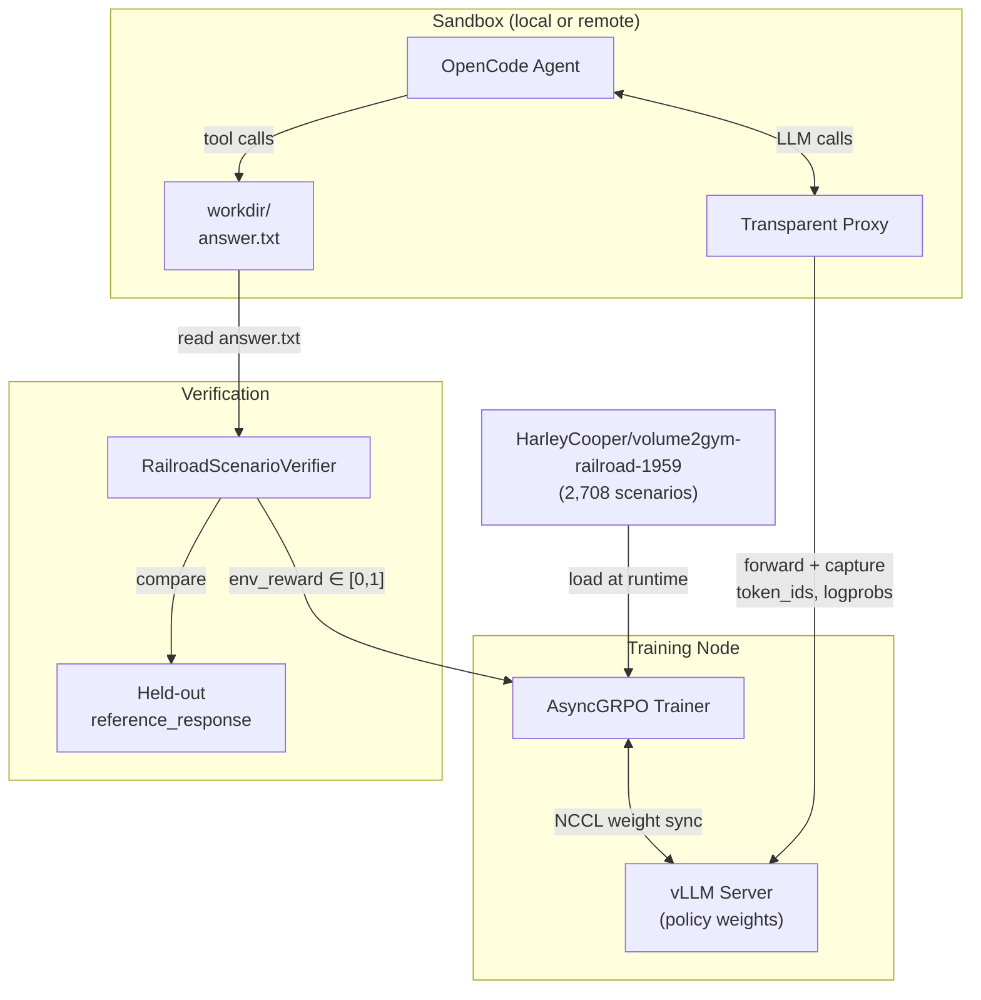
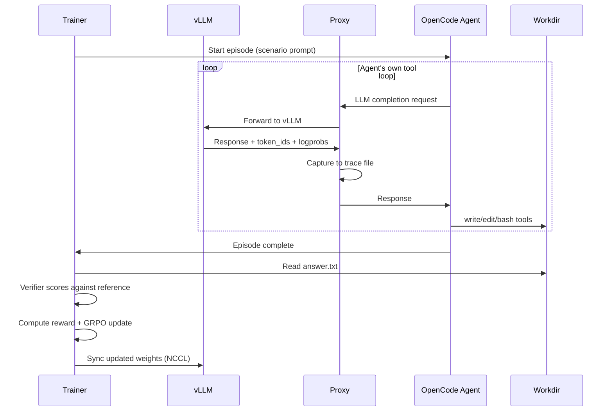

# RailroadHarness

OpenCode harness training (TRL + OpenEnv) adapted to 1959 railroad operating rules.

[](https://huggingface.co/datasets/HarleyCooper/volume2gym-railroad-1959)
[](LICENSE)
[](https://huggingface.co/blog/sergiopaniego/trl-openenv-harness-training)

> **⚠️ Historical Research Artifact**: These are 1959 rules that may conflict with current regulations, technology, and safe practice. **Do NOT use for real railroad operations.**

## Overview

RailroadHarness is a learning example that adapts Hugging Face TRL's [OpenCode harness training](https://huggingface.co/blog/sergiopaniego/trl-openenv-harness-training) from coding tasks (DeepCoder) to railroad operating-rule scenarios. It demonstrates how the same AsyncGRPO + OpenEnv architecture can train agents on domain-specific procedural knowledge.

**What this repo provides:**
- Training scripts for local subprocess and remote HF sandbox modes
- A deterministic verifier using normalized exact match / token F1 scoring
- Documentation mapping DeepCoder concepts to the railroad domain
- Unit tests for the scoring logic

**What this repo does NOT provide:**
- A production RL system
- Operational railroad advice
- The dataset itself (loaded from Hugging Face Hub at runtime)

## Architecture



### Loop-Owning Mode

OpenCode owns its own tool loop. TRL captures the trajectory through a transparent proxy:



## DeepCoder → Railroad Mapping

| Aspect | DeepCoder (Original) | Railroad (This Repo) |
|--------|---------------------|---------------------|
| **Dataset** | `agentica-org/DeepCoder-Preview-Dataset` | `HarleyCooper/volume2gym-railroad-1959` |
| **Task** | Solve competitive coding problem | Respond to 1959 operating-rule scenario |
| **Agent writes** | `solution.py` | `answer.txt` |
| **Verification** | Run code on stdin/stdout tests | Text similarity to reference |
| **Reward** | Fraction of tests passed | Exact match (1.0) or token F1 |
| **Required tool** | `bash` (must execute code) | `write`/`edit` (must write answer) |
| **Penalty: no action** | -0.1 if no bash call | -0.1 if no write/edit call |
| **Step budget** | 20 tool calls | 15 tool calls |

## Quick Start

### Prerequisites

- Python 3.10+
- CUDA-capable GPU(s)
- `HF_TOKEN` environment variable (for remote sandbox mode)

### Installation

```bash
git clone https://github.com/HarleyCoops/RailroadHarness.git
cd RailroadHarness

# For local subprocess mode
pip install -e ".[local]"

# For remote HF sandbox mode
pip install -e ".[remote]"

# For development (includes tests)
pip install -e ".[dev]"
```

### Run Tests

```bash
pytest tests/test_verifier.py -v
```

### Local Training (2 GPUs)

```bash
# Terminal 1: Start vLLM server
CUDA_VISIBLE_DEVICES=0 VLLM_SERVER_DEV_MODE=1 vllm serve Qwen/Qwen3-4B-Instruct-2507 \
    --host 0.0.0.0 --port 8000 \
    --enable-auto-tool-choice --tool-call-parser hermes \
    --logprobs-mode processed_logprobs \
    --return-tokens-as-token-ids \
    --weight-transfer-config '{"backend":"nccl"}'

# Terminal 2: Run training
CUDA_VISIBLE_DEVICES=1 python train_railroad_local.py \
    --model Qwen/Qwen3-4B-Instruct-2507 \
    --vllm-url http://localhost:8000 \
    --n-prompts 64 \
    --num-generations 8 \
    --max-steps 100
```

### Remote HF Sandbox Training

Requires a tunnel to expose vLLM to remote sandboxes:

```bash
# Terminal 1: vLLM server (same as above)

# Terminal 2: Create tunnel
cloudflared tunnel --no-autoupdate --url http://localhost:8000
# Note the https://<name>.trycloudflare.com URL

# Terminal 3: Train with remote sandboxes
CUDA_VISIBLE_DEVICES=1 python train_railroad_hf_sandbox.py \
    --model Qwen/Qwen3-8B-Instruct-2507 \
    --vllm-url http://localhost:8000 \
    --sandbox-vllm-url https://<name>.trycloudflare.com \
    --n-prompts 64 \
    --num-generations 8 \
    --max-steps 100
```

### Tiny First Run

For testing the setup with minimal resources:

```bash
python train_railroad_local.py \
    --model Qwen/Qwen3-4B-Instruct-2507 \
    --n-prompts 8 \
    --num-generations 2 \
    --max-steps 5 \
    --max-inflight 2
```

## File Structure

```
RailroadHarness/
├── README.md                      # This file
├── LICENSE                        # Apache 2.0
├── pyproject.toml                 # Package configuration
├── .gitignore
│
├── railroad_verifier.py           # Scoring logic + verifier class
├── train_railroad_local.py        # Local subprocess training
├── train_railroad_hf_sandbox.py   # Remote HF sandbox training
├── launcher.py                    # Optional HF Jobs launcher
│
├── docs/
│   └── LEARNING_NOTES.md          # Detailed learning guide
│
└── tests/
    ├── __init__.py
    └── test_verifier.py           # Unit tests for verifier
```

## Scoring Details

The verifier implements the scoring approach from the [volume2gym dataset card](https://huggingface.co/datasets/HarleyCooper/volume2gym-railroad-1959):

1. **Normalize**: Lowercase, collapse whitespace, strip
2. **Exact match check**: If normalized texts match → reward = 1.0
3. **Token F1 fallback**: Whitespace-token multiset F1 for partial credit

```python
from railroad_verifier import compute_similarity_reward

# Exact match
compute_similarity_reward("Stop the train.", "stop the train")  # → 1.0

# Partial match (F1)
compute_similarity_reward("Stop the train.", "Stop immediately.")  # → ~0.4
```

## Configuration Options

### Common Arguments

| Argument | Default | Description |
|----------|---------|-------------|
| `--model` | `Qwen/Qwen3-4B-Instruct-2507` (local) / `Qwen3-8B` (remote) | Model to train |
| `--vllm-url` | `http://localhost:8000` | Local vLLM URL |
| `--n-prompts` | 64 | Number of scenarios to sample |
| `--num-generations` | 8 | Rollouts per prompt |
| `--max-steps` | 100 | Training steps |
| `--max-inflight` | 8 | Concurrent sandboxes |
| `--learning-rate` | 1e-5 | Learning rate |
| `--temperature` | 1.0 | Sampling temperature |

### Remote-Only Arguments

| Argument | Default | Description |
|----------|---------|-------------|
| `--sandbox-vllm-url` | *required* | Public URL for sandboxes to reach vLLM |
| `--sandbox-image` | `ghcr.io/huggingface/openenv-opencode-sandbox:latest` | Sandbox container image |
| `--sandbox-flavor` | `cpu-basic` | HF sandbox flavor |

## Links

### Primary Sources
- **TRL OpenEnv Blog**: [trl-openenv-harness-training](https://huggingface.co/blog/sergiopaniego/trl-openenv-harness-training)
- **TRL OpenCode Scripts**: [huggingface/trl/examples/scripts/openenv](https://github.com/huggingface/trl/tree/main/examples/scripts/openenv)
- **OpenEnv Docs**: [huggingface.co/docs/openenv](https://huggingface.co/docs/openenv)

### Dataset & Upstream
- **Dataset**: [HarleyCooper/volume2gym-railroad-1959](https://huggingface.co/datasets/HarleyCooper/volume2gym-railroad-1959)
- **volume2gym Pipeline**: [github.com/HarleyCoops/volume2gym](https://github.com/HarleyCoops/volume2gym)
- **Prior Railroad RL**: [github.com/HarleyCoops/Qwen3-RailroadEngineer1959-RL](https://github.com/HarleyCoops/Qwen3-RailroadEngineer1959-RL)

### TRL & HuggingFace
- **TRL Documentation**: [huggingface.co/docs/trl](https://huggingface.co/docs/trl)
- **AsyncGRPO**: Part of TRL's experimental module

## Safety Disclaimer

**This is a historical research artifact, not operational guidance.**

The 1959 Consolidated Code of Operating Rules represents railroad procedures from over 60 years ago. Modern railroads operate under different:
- Federal regulations (FRA, 49 CFR)
- Technology (PTC, radio communications)
- Safety practices
- Operational procedures

**Do NOT use any output from models trained with this harness for:**
- Operating trains
- Railroad safety decisions
- Personnel qualification
- Regulatory compliance

This repository exists to demonstrate RL training techniques on bounded procedural text, not to provide railroad operational knowledge.

## Attribution

- **Author**: [HarleyCoops](https://github.com/HarleyCoops)
- **Adapted from**: [TRL OpenEnv harness training](https://huggingface.co/blog/sergiopaniego/trl-openenv-harness-training) by The HuggingFace Team
- **Dataset source**: Consolidated Code of Operating Rules—Revised 1959

## License

Apache License 2.0 - see [LICENSE](LICENSE) for details.

Matches TRL and HuggingFace licensing for compatibility.
